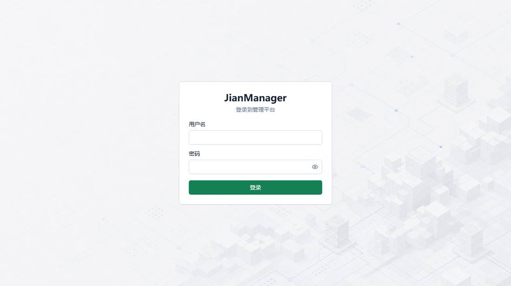
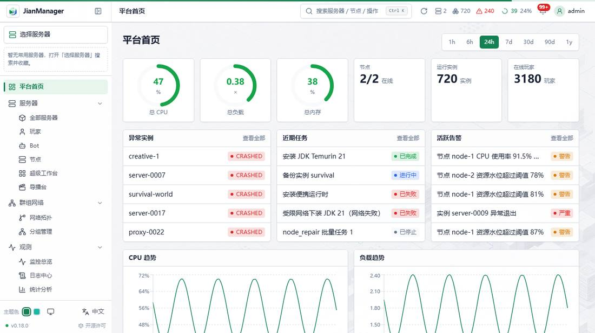
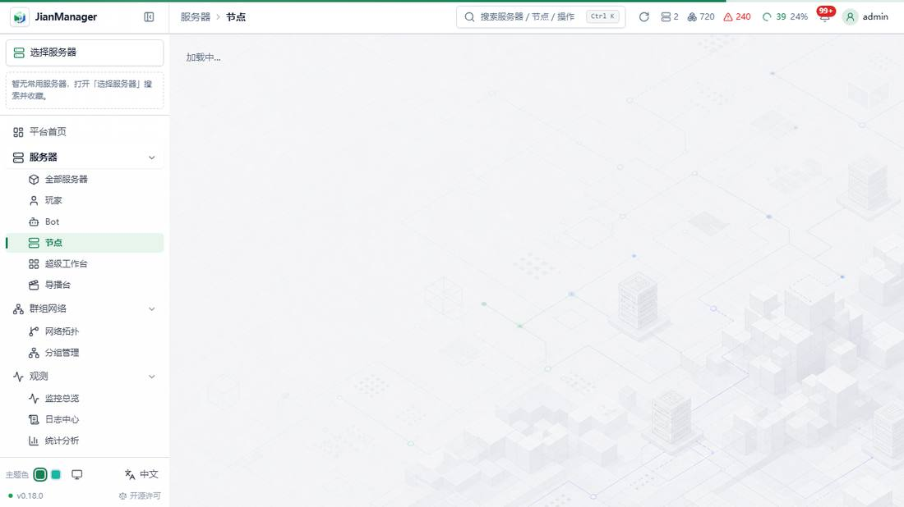
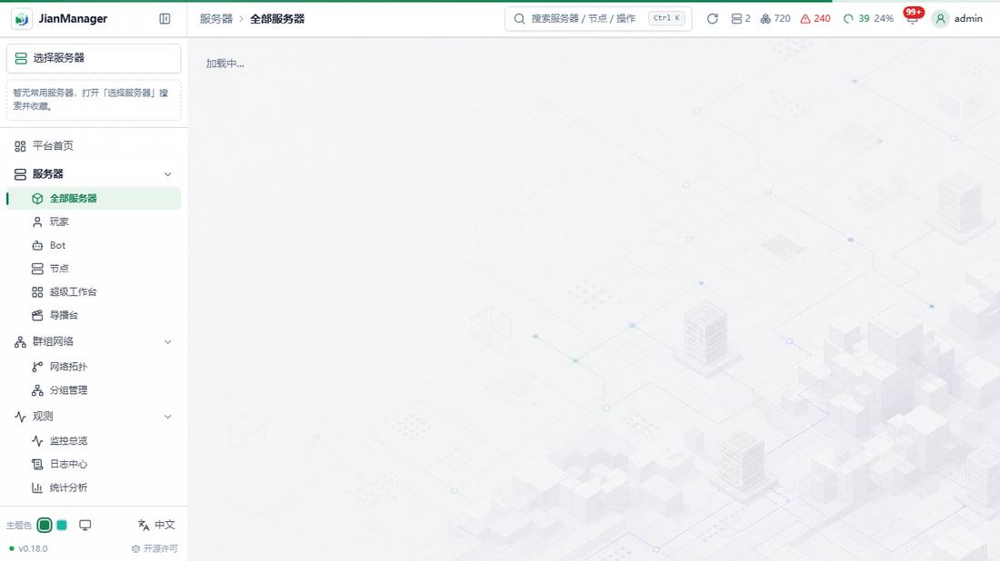
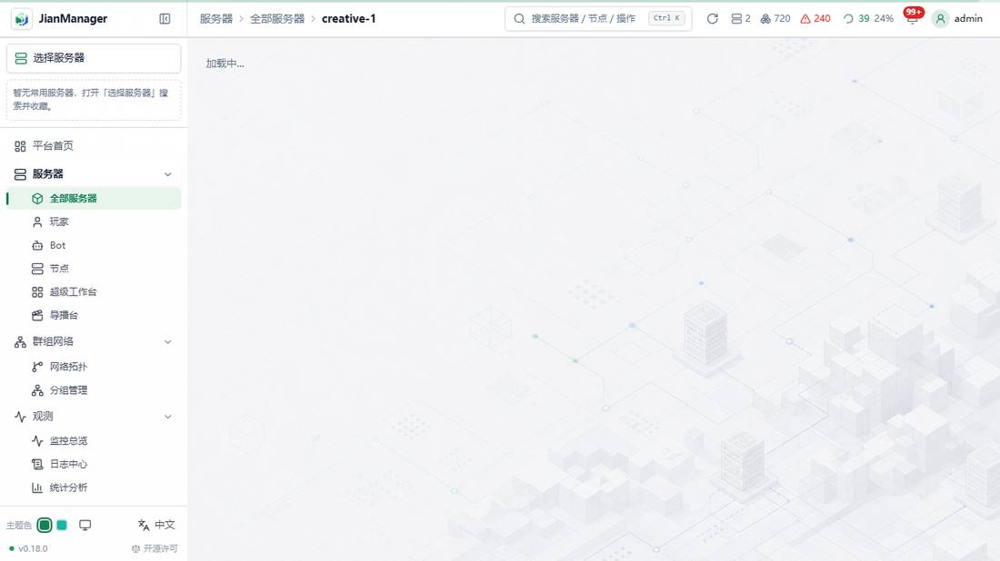

<div align="center">

# JianManager

**多节点游戏服务器管理面板 · 单二进制部署 · NAT 友好 · 为 Minecraft 群组服而生**

[](https://github.com/wcpe/JianManager/releases/latest)
[](https://github.com/wcpe/JianManager/actions/workflows/release.yml)
[](https://github.com/wcpe/JianManager/actions/workflows/ci.yml)
[](go.mod)
[](LICENSE)

</div>

JianManager 是面向中小型游戏服务器运营团队的自托管管理平台：一个 Go 二进制内嵌完整 React 控制台，落地即用（零配置 SQLite 起步，生产可切 MySQL）；受管节点经**反向隧道只出站接入**——家用宽带 NAT、内网、云主机混合组网都不需要在节点侧开放任何入站端口。

从「在面板上点一下搭出 Paper/Velocity 群组服」到「托管 JDK/Node.js 运行时、Bot 自动化、监控告警、备份、客户端整合包 OTA 分发」，覆盖游戏服日常运营的完整生命周期。

## ✨ 核心特性

**部署与接入**
- **单二进制**：前端经 `go:embed` 内嵌，Control Plane 一个文件即整个面板；SQLite 零配置起步
- **节点零入站接入**：Worker 主动建立 gRPC 反向隧道，NAT / 内网机器免端口映射；无隧道时节点不可调用
- **一键装节点**：面板生成安装命令，目标机粘贴执行即注册上线（systemd / Windows 双平台，Worker 二进制内嵌在面板里，**离线 / 受限网络也能装**）
- **SSH 推送部署**：Linux 普通用户通过 `deploy-cp.sh` / `deploy-worker.sh` 获得永久版本目录、显式回滚与配置/数据/节点身份无损迁移
- **在线自更新**：面板内检查新版 / 一键升级 / 回滚上一版（CP 与全部节点）

**实例与 Minecraft**
- **实例全生命周期**：创建 / 启动 / 停止 / 重启，状态机驱动；direct / 守护进程 / **Docker 容器**（资源限额）三种运行方式
- **一键搭建群组服**：选版本即搭 Paper 子服 / Velocity 代理，核心下载、初始配置、探针部署全程任务中心可观测；版本-JDK 兼容与启动前同步预检把配置错误拦在启动之前
- **导入现有服务器**：浏览节点目录 → 探测核心 / 端口 / JDK → 就地接管或搬入托管区
- **崩溃可诊断**：启动失败原因横幅、退出快照（退出码 + 尾部日志）、状态光晕一眼分辨运行态
- **内存水位守卫**：CP 预警 + Worker 实时双闸，杜绝「开一个服把整台节点 OOM 拖死」

**终端与文件**
- **Web 终端**：xterm.js 实时终端经面板中转直达实例 stdin/stdout，页签切换连接不断
- **资源管理器**：在线浏览 / 编辑 / 上传（流式 + 进度）/ 下载 / 打包，jar 反编译速览
- **备份恢复**：手动 / 定时备份，支持 S3 兼容对象存储做异地端点

**运行时与资产**
- **托管多 JDK**：foojay 多厂商多版本一键下载安装、自动扫描已装 JDK、实例级绑定
- **Node.js 运行时与全局包**：节点级包管理器（npm/pnpm，多 registry / 镜像源），Bot 依赖装全局即用
- **制品缓存**：服务端核心 / 探针等制品节点级缓存，重复建服秒命中

**可观测与运营**
- **监控**：节点 / 实例 CPU · 内存 · TPS · MSPT 时序图表，进程级采集，探针（ServerProbe）深度指标
- **告警与通知**：阈值告警 + Webhook；任务中心 + 站内信收敛全部长任务进度与终态
- **日志与审计**：平台日志中心（API 错误自动落库可追查）、审计日志含失败操作与错误内容、操作名中英双语
- **Bot 平台**：Mineflayer Bot 托管（follow / guard / patrol 行为引擎），bot-worker 运行时由面板自动下发自愈
- **客户端 OTA 分发**：整合包发布 / 分块上传 / Ed25519 签名 manifest / 防降级，玩家侧启动器增量更新

**安全与体验**
- 用户组权限模型 · JWT 会话与 WS 令牌密钥隔离 · 出站代理（受限网络下载）· `jmctl` 应急控制台（面板不可用时本机直连守护进程）· 双主题明暗模式 · 中英 i18n

## 🚀 快速开始

### 1. 启动面板（Control Plane）

**方式 A — 一键安装脚本（FR-355）**（自动识别 OS/arch，从 GitHub Releases 拉取）：

```bash
# Linux / macOS
curl -fsSL https://raw.githubusercontent.com/wcpe/JianManager/dev/scripts/install-cp.sh | sh
./control-plane
```

```powershell
# Windows PowerShell
irm https://raw.githubusercontent.com/wcpe/JianManager/dev/scripts/install-cp.ps1 | iex
.\control-plane.exe
```

**方式 B — 手动下载二进制**：

```bash
# Linux amd64
curl -fsSLo control-plane https://github.com/wcpe/JianManager/releases/latest/download/control-plane-linux-amd64
chmod +x control-plane && ./control-plane
# Windows：下载 control-plane-windows-amd64.exe 后运行
```

浏览器打开 `http://<主机>:8080`，跟随首启引导创建管理员账号——零配置即可跑起来（数据默认落 `data/` 下的 SQLite）。生产请设置 `JIANMANAGER_JWT_SECRET`。完整说明见 [docs/DEPLOY.md](docs/DEPLOY.md) 与 [SECURITY.md](SECURITY.md)。

### 2. 添加节点（Worker）

面板 **「节点 → 添加节点」** 会生成一条一键安装命令，到目标机粘贴执行即可：Worker 安装为系统服务、自动注册上线，并经反向隧道保持连接——**节点侧无需开放任何入站端口**，家用 NAT 后的机器也能直接接入。

### 3. 开服

**「实例 → 一键搭建」** 选择 Minecraft 版本与节点即可搭出 Paper 子服或 Velocity 代理；已有服务器目录则用 **「导入现有服务器」** 就地接管。

### 界面预览

> 下列截图来自前端 MSW mock 模式，仅作界面示意（非生产真机数据）。

| 登录 | 首页总览 | 节点 |
|:---:|:---:|:---:|
|  |  |  |

| 实例列表 | 服务器控制台 |
|:---:|:---:|
|  |  |

### 其它部署方式

<details>
<summary><b>Docker Compose（FR-354）</b></summary>

```bash
make docker && make docker-up   # 构建镜像并起 CP + Worker
# 浏览器 http://localhost:8080
docker compose logs -f control-plane
make docker-down
```

Worker 须使用环境变量 `JIANMANAGER_CONTROL_PLANE_GRPC`（compose 已写好）。数据卷、密钥与排障见 [docs/DEPLOY.md §11](docs/DEPLOY.md)。
</details>

<details>
<summary><b>SSH 推送部署（推荐用于远程 Linux 主机）</b></summary>

在操作机把本地构建产物经 SSH 推送部署 / 更新，首次与更新自动判定、幂等可重复。普通用户的 systemd user 服务使用 `current → versions/<版本>--<UTC>--<sha12>`：每次部署永久保留，稳定配置、数据与 Worker 身份不随切换替换。

```bash
# 部署面板
JM_SSH_HOST=1.2.3.4 JM_SSH_USER=deploy JM_SERVICE_SCOPE=user scripts/deploy-cp.sh
# 部署节点（首次需在面板签发 token；更新可省）
JM_SSH_HOST=5.6.7.8 JM_SSH_USER=deploy JM_SERVICE_SCOPE=user JM_CONTROL_PLANE=1.2.3.4:9100 JM_ENROLL_TOKEN=jmet_xxx scripts/deploy-worker.sh
# 显式回滚到 versions/ 下列出的某个版本目录
JM_SSH_HOST=1.2.3.4 JM_SSH_USER=deploy scripts/rollback-cp.sh <版本目录名>
JM_SSH_HOST=5.6.7.8 JM_SSH_USER=deploy scripts/rollback-worker.sh <版本目录名>
```

版本化布局仅适用于普通用户（user 级 systemd + linger）；root / 免密 sudo 的 system scope 保持既有直装 `.bak` 更新行为。详见 [docs/DEPLOY.md](docs/DEPLOY.md)。
</details>

<details>
<summary><b>从源码构建</b></summary>

需要 Go 1.26.2、Node.js 22（Bot Worker 与受管节点运行时要求 `>=22.13.0`）、pnpm（经 corepack）和 go-task：

```bash
go install github.com/go-task/task/v3/cmd/task@latest
task dist    # 前端 + Bot Worker + 全部内嵌资产 + Windows/Linux amd64 四个二进制 → dist/
```

`task dist` 会把 Bot Worker 的生产构建归档内嵌进 Control Plane，并为所有 Go 产物注入同一版本。源码版本真值来自 `internal/version/version.go`；当前正式发布提交为 `0.18.0`，对应本地 tag `v0.18.0`。后续进入新开发窗口时再切换为下一目标版本的 `X.Y.Z-dev`。
</details>

## 🏗 架构

```
 浏览器（React SPA，go:embed 内嵌）
     │  HTTP / WS（终端经面板中转）
     ▼
 Control Plane（Go，×1）────── SQLite / MySQL
     ▲  gRPC 反向隧道（Worker 只出站）
     │
 Worker Node（Go，×N）
     ├── 进程管理（direct / 守护进程 / Docker）
     ├── ServerProbe 探针桥（TPS/MSPT 等深度指标）
     └── Bot Worker（Node.js 子进程，Mineflayer）
```

| 进程 | 语言 | 数量 | 职责 |
|---|---|---|---|
| Control Plane | Go | 1 | API、认证、调度、数据库、前端托管、制品分发 |
| Worker Node | Go | N | 游戏服进程管理、终端、指标采集、文件操作 |
| Bot Worker | Node.js | 按需 | Mineflayer 连接与行为引擎 |

**端口**：对外仅需暴露面板 HTTP（默认 `8080`）与 CP gRPC（默认 `9100`，供节点出站连接）；Worker 不开放 CP 入站 gRPC，WS `9102` 仅供本机回环终端桥与本机探针使用。

## ⚙️ 配置

零配置可跑；需要定制时在工作目录放 `control-plane.yml`：

```yaml
server:
  port: 8080
database:
  driver: sqlite          # 或 mysql
  dsn: data/jianmanager.db
log:
  level: info
```

所有配置项均可用 `JIANMANAGER_` 前缀环境变量覆盖（如 `JIANMANAGER_SERVER_PORT=9090`）。JWT / WS 密钥生产态自动生成持久化，无需手工配置。完整配置与运维手册见 [docs/DEPLOY.md](docs/DEPLOY.md)。

## 🧑‍💻 开发

多语言 monorepo，[go-task](https://taskfile.dev) 统一命令面（Windows / Linux 同套动词）：

```bash
task            # 列出全部任务
task dev:cp     # 起 Control Plane（--dev 反代前端 dev server）
task dev:web    # 前端 Vite dev server
task dev:mock   # 前端 mock 模式（MSW 有状态假后端，无需真后端即可跑整站）
task build      # Go 全部包 + 前端两应用
task test       # Go + 前端全部测试
task lint       # go vet + tsc + eslint
task web:e2e    # Playwright 真浏览器整站 E2E（mock 模式）
```

```
apps/                  # 可运行外壳：control-plane / worker / jmctl（Go）
                       #             control-plane-web / ui-museum（React）/ bot-worker（Node.js）
packages/              # 共享 JS 库：ui / devmock / tsconfig / eslint-config（pnpm workspace）
internal/              # Go 内部包（controlplane / worker / platform）
proto/                 # gRPC Protobuf 定义
docs/                  # 架构 / API / 部署 / ADR 全套文档
```

CI 在 PR 与分支 push 上跑 `web-quality`（lint + vitest + 构建 + E2E）与 `bot-quality`（生产依赖审计 + typecheck + lint + build）双门禁。发布 workflow 另以独立 metadata job 校验源码版本、Git ref 与 tag，同版本构建/内嵌 Bot Worker 和四个 Go 产物，再分别在 Linux / Windows 原生 runner 执行四项 `--version` smoke；全部通过后才创建 Release。

版本规则见 [ADR-074](docs/adr/074-release-version-provenance-and-smoke.md)：正式 Git tag / Release 为 `vX.Y.Z`，二进制内部版本为裸 `X.Y.Z`；开发构建为 `X.Y.Z-dev+g<sha>`。当前工作区实现尚未 push，远端 GitHub Actions 运行结果待验。提交信息遵循 Conventional Commits（中文描述），详见 [docs/CONVENTIONS.md](docs/CONVENTIONS.md)。

## 📚 文档

| 文档 | 内容 |
|---|---|
| [DEPLOY.md](docs/DEPLOY.md) | 部署与运维手册（发布产物 / systemd / 网络与密钥 / 排障） |
| [ARCHITECTURE.md](docs/ARCHITECTURE.md) | 系统架构（进程模型 / 通信协议 / 数据模型） |
| [API.md](docs/API.md) | REST API 参考 |
| [PRD.md](docs/PRD.md) | 产品需求与功能索引 |
| [CONVENTIONS.md](docs/CONVENTIONS.md) | 编码与协作规范 |
| [docs/adr/](docs/adr/) | 全部架构决策记录（ADR） |

## 📄 许可证

[MIT](LICENSE)
