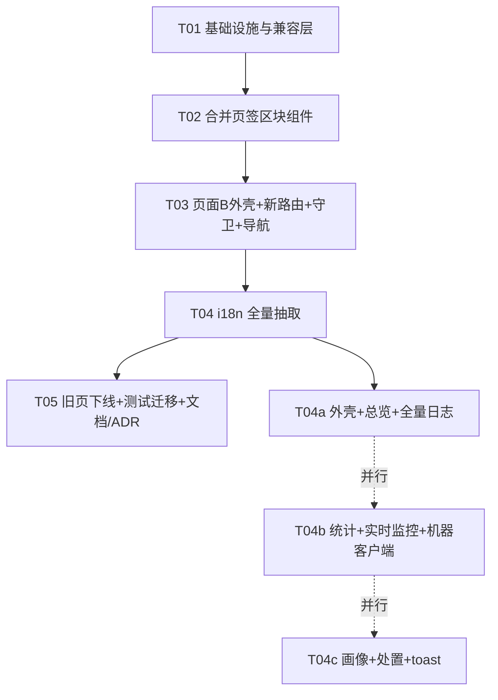
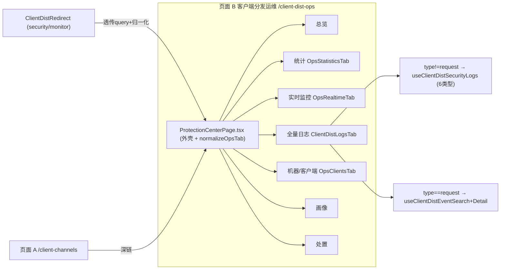

# 客户端分发信息架构合并 · 增量设计（Architect · 终稿）

> 状态：终稿（用户已拍板 5 项，见 §0；**已按本稿实现**）　·　类型：feat（前端 IA/路由/权限/i18n 增量）　·　后端：**零改动**
> 关联 FR：提案 **FR-430**（PRD 现行最大为 FR-429）　·　关联 ADR：**新增 ADR-088**（`docs/adr/088-client-dist-ia-merge-ops-page.md`）；修订语境见 ADR-049 / ADR-055 / FR-264 / FR-265
> 仓库：`repo-root`（pnpm workspace monorepo；前端 `apps/control-plane-web`）
> 配套文件：`spec.md`（正式规格）、`sequence-diagram.mermaid`、`class-diagram.mermaid`

---

## 0. 用户拍板结果与本稿变更（over 初稿）

| # | 拍板 | 对初稿的改动 |
|---|---|---|
| 1 | **页面 B 正式路由 = `/client-dist-ops`**（采纳改名，不沿用 `/client-dist-security`） | 新路由 + 两条旧路由重定向（均透传 query 并按归一化映射）；`data-page="client-dist-ops"`；逐一处理引用点（见 §2.1） |
| 2 | **Tab 收敛 7 个**（采纳推荐） | 确认：总览/统计/实时监控/全量日志/机器·客户端/画像/处置 |
| 3 | **补路由守卫** | `/client-channels` 与 `/client-dist-ops` 包 `RequirePlatformAdmin`；两条重定向不包 |
| 4 | **i18n 全量（含存量硬编码）** | 重写 §5；单列任务 **T04（含 3 子步骤）**；实测条数见 §5.4 |
| 5 | **补 ADR** | 新增 **ADR-088**（§6.5 + 独立文件），并登记 PRD FR-430 |

---

## 1. 目标 IA

### 1.1 页面 A「客户端分发」（作者/发布侧，per-channel）

**路由不变**：`/client-channels`（`Workspace.tsx:137`）→ `ClientChannelsPage.tsx`，**内容零改动**（仅 §2.1 的一处跨页深链重指向 `/client-dist-ops`）。

工作台 Tab 不变：`keys | versions | core | stats | guide`；`stats` 粒度 = **单频道**（`useClientStats` FR-095 + `useClientDistObservability` FR-217/219 + 洞察卡/热力图/机器清单 FR-425~428）。新增文案标注「本频道口径」。

### 1.2 页面 B「客户端分发运维」（观测 + 研判处置）

**正式路由**：`/client-dist-ops` → `ProtectionCenterPage.tsx`（重写为运维页外壳）。`data-page="client-dist-ops"`。

| # | Tab | key | 数据源 hook | 粒度 | 权限 | URL 参数 | 来源 |
|---|---|---|---|---|---|---|---|
| 1 | 总览 | `overview` | `useClientDistSecurityOverview`（`api/clientDistSecurity.ts:236`） | 跨频道 | 平台管理员 | `tab` | 安全 `overview` |
| 2 | 统计 | `statistics` | `useClientStats`（`clientStats.ts:44`）+ `useClientDistErrorSummary`（`clientDistEvents.ts:232`） | **跨频道**（可筛单频道） | 平台管理员 | `tab,channelId,from,to` | 监控 `statistics` |
| 3 | 实时监控 | `monitor`（`seg=live`缺省） | `useClientDistRealtime`（`clientDistEvents.ts:248`）+ `useClientDistErrorSummary`；`seg=events` 叠 `useClientDistSecurityEvents`（`clientDistSecurity.ts:253`） | 跨频道（可筛单频道） | 平台管理员 | `tab,channelId,seg` | 监控 `monitor` + 安全 `events` |
| 4 | 全量日志 | `logs` | `type!=request`：`useClientDistSecurityLogs`（`clientDistSecurity.ts:261`）；`type=request`：`useClientDistEventSearch`（`clientDistEvents.ts:156`）+ `useClientDistEventDetail`（`:219`） | 跨频道（可筛单频道/机器/IP/玩家/错误码） | 平台管理员 | `tab,type,channelId,ip,machineId,errCode,version,from,to` | 监控 `logs` + 安全 `logs`（合一） |
| 5 | 机器 / 客户端 | `clients` | `ObsOverviewSection`（`useClientDistObservability` + `useClientDistMachines`）+ `useClientRuntimeOverview`（`api/clientRuntimeStates.ts`） | 跨频道（可筛单频道，更新侧） | 平台管理员 | `tab,channelId,from,to` | 监控 `clients` |
| 6 | 画像 | `profiles`（`seg=client`缺省） | `useClientDistSecurityProfiles`（`:270`）+ `useClientDistSecurityProfile`（`:278`）；`seg=ip` 叠 `useClientDistIpAnalysis`（`:295`）；`seg=player` 叠 `useClientDistPlayerAnalysis`（`:303`） | 跨频道（实体聚合） | 平台管理员 | `tab,seg,channelId,ip,machineId` | 安全 `profiles`+`ip`+`players` |
| 7 | 处置 | `actions`（`seg=actions`缺省） | `useClientDistSecurityActions`（`:287`）+ 三种 mutate + `useCancelClientDistIPBlock`（`:335`）；`seg=groups` 叠 `useClientDistSecurityGroups`（`:311`） | 跨频道 | 平台管理员 | `tab,seg` | 安全 `actions`+`groups` |

**页头控件**（合并后）：频道选择器（原监控页 `ClientDistMonitoringPage.tsx:826`）+ `ObsTimeRangePicker` + `ClientDistExportButton kind="stats-summary"`。**删除**原「打开分发监控」按钮（`ProtectionCenterPage.tsx:1041`），保留「打开频道工作台」。

### 1.3 Tab 映射表（旧路由 × 旧 tab → 新路由 tab）

| 来源路由 | 旧 tab key | 新 Tab | 新 `seg` | 新 `type` |
|---|---|---|---|---|
| `/client-dist-monitor` | `statistics` | `statistics` | — | — |
| `/client-dist-monitor` | `monitor` | `monitor` | `live`(缺省) | — |
| `/client-dist-monitor` | `logs` | `logs` | — | `request`（缺省补） |
| `/client-dist-monitor` | `clients` | `clients` | — | — |
| `/client-dist-security` | `overview` | `overview` | — | — |
| `/client-dist-security` | `events` | `monitor` | `events` | — |
| `/client-dist-security` | `logs` | `logs` | — | 保持/缺省（`all` 或不带） |
| `/client-dist-security` | `profiles` | `profiles` | `client` | — |
| `/client-dist-security` | `ip` | `profiles` | `ip` | — |
| `/client-dist-security` | `players` | `profiles` | `player` | — |
| `/client-dist-security` | `actions` | `actions` | `actions` | — |
| `/client-dist-security` | `groups` | `actions` | `groups` | — |
| `/client-channels` | `keys/versions/core/stats/guide` | 页面 A 不变 | — | — |

缺省/非法 `tab` → `overview`（页面 B Landing）。

### 1.4 安全页存量 Tab 处置意见（明确）

- `overview` → 保留 Tab 1（安全态势，与 Tab 2 请求历史语义不同，**都留**）。
- `events` → 并入 Tab 3「实时监控」`seg=events`（`EventRow` + 三组 `DangerConfirm` 处置完整保留）。
- `ip` + `players` → 并入 Tab 6「画像」`seg=ip|player`。
- `profiles` → Tab 6 主档 `seg=client`。
- `actions` + `groups` → 并入 Tab 7「处置」`seg=actions|groups`。
- 结论：安全页 8 Tab → 收敛进 4 个 Tab，**功能零丢失**。

---

## 2. 路由与兼容策略

### 2.1 页面 B 正式路由 `/client-dist-ops` + 两条重定向

`Workspace.tsx` 改动（新增 lazy + 路由 + 守卫）：

```
const ProtectionCenterPage = lazy(() => import('@/pages/ProtectionCenterPage'))  // 已有，保留
const ClientDistRedirect    = lazy(() => import('@/pages/ClientDistRedirect'))   // 新增

// 页面 A：补守卫
<Route path="client-channels" element={<RequirePlatformAdmin><ClientChannelsPage /></RequirePlatformAdmin>} />

// 页面 B：新路由 + 守卫
<Route path="client-dist-ops"  element={<RequirePlatformAdmin><ProtectionCenterPage /></RequirePlatformAdmin>} />

// 旧路由：重定向（不包守卫，只做 Navigate）
<Route path="client-dist-security" element={<ClientDistRedirect source="security" />} />
<Route path="client-dist-monitor"  element={<ClientDistRedirect source="monitor" />} />
```

**`ClientDistRedirect`（新组件，单文件双来源）**：读 `readClientDistQuery(searchParams)` → `normalizeOpsTab(rawTab, source)` → `buildClientDistHref('/client-dist-ops', searchParams, patch)` → `<Navigate to={target} replace />`。**必须透传 query**（`channelId/ip/machineId/errCode/version/from/to`），并补 `tab/seg/type`。

`normalizeOpsTab`（`src/lib/client-dist-ops-tab.ts`）同时服务重定向与页面 B 的旧 key 兜底。

**逐一处理引用点**（用户点名清单）：

| 位置 | 现值 | 改为 |
|---|---|---|
| `ClientChannelsPage.tsx:364` | `buildClientDistHref('/client-dist-security', …, {channelId, tab:'logs'})` | `'/client-dist-ops'`（`tab:'logs'` 保留；安全摘要条语义对齐全量日志） |
| `ClientDistMonitoringPage.tsx:486`（`LinkedFilterHint`「打开安全中心」） | `buildClientDistHref('/client-dist-security', …, {tab:'logs'})` | **该文件删除**；逻辑迁入 `ClientDistLogsTab.tsx`，目标 `'/client-dist-ops'`（页内 `type` 切换，不再跨页） |
| `ProtectionCenterPage.dom.test.tsx:98` | 断言 `打开分发监控` → `/client-dist-monitor?...` | **删除该断言**（按钮已移除）；改为断言页内 `type/seg` 行为或导航链路 |
| `ProtectionCenterPage.dom.test.tsx:102` | 断言 `打开频道工作台` → `/client-channels?...` | 保留 |
| `client-dist-query.test.ts:22,27` | 用例以 `/client-dist-security` 组 href | 改 `/client-dist-ops`；并补 `type/seg` 透传断言 |
| `ClientDistMonitoringPage.dom.test.tsx:155` | `打开安全中心` href `/client-dist-security?...` | 用例迁移到新页测试，期望 `/client-dist-ops?...` |
| `ProtectionCenterPage.dom.test.tsx:73` | `data-page="client-dist-security"` | `data-page="client-dist-ops"` |
| `lib/breadcrumb.ts` | 无 `client-dist-ops`；有 `client-dist-monitor`（:25/:56） | **新增** `client-dist-ops`（域 `nav.platformManagement`，页 `nav.clientDistOps`）；旧 `client-dist-security` 映射：**建议保留（改指 `nav.clientDistOps`）作为重定向容错**（重定向后基本不可达，留着零风险；删除亦可，二选一，本稿取"保留"以少动测试） |
| `ConsoleSidebar.dom.test.tsx:40` | 观测组断言「客户端分发监控」→ `/client-dist-monitor` | 删除该断言；新增平台管理组「客户端分发运维」→ `/client-dist-ops`；观测组改断言不含该入口 |

### 2.2 旧 tab key 兼容（归一化）

- **新增冻结 query key**：`'type'`、`'seg'`（追加进 `lib/client-dist-query.ts:1` 的 `CLIENT_DIST_QUERY_KEYS`，向后兼容）。
- `useTabParam`（`lib/use-tab-param.ts`）对非法值回落默认，故页面 B 先取原始 `tab`→`normalizeOpsTab(raw,'security')`→canonical，再写回。
- `normalizeOpsTab(raw, source)` 返回 `{ tab, seg?, type? }`，映射规则见 §1.3；`ip/players/events/groups` 为旧别名，落对应 Tab + seg。

### 2.3 导航分组与文案

`nav-config.ts`：
- 观测组（`:86`）**删除** `{ to:'/client-dist-monitor', labelKey:'nav.clientDistMonitor' }`（`:93`）。
- 内容与分发组（`:100`）把 `{ to:'/client-dist-security', labelKey:'nav.clientDistSecurity' }`（`:107`）改为 `{ to:'/client-dist-ops', labelKey:'nav.clientDistOps' }`。
- 保留 `nav.clientDistMonitor` / `nav.clientDistSecurity` 键（不删，避免残留引用报缺键）。

### 2.4 面包屑

- **新增** `client-dist-ops` → 域 `nav.platformManagement`、页 `nav.clientDistOps`。
- 旧两条映射策略见 §2.1（本稿取"保留 + 重指"）。

---

## 3. 去重设计（全量日志合一）

### 3.1 现状：`request` 类数据两套 UI（真重复）

- 监控页 `LogsTab`（`ClientDistMonitoringPage.tsx:414`）→ `useClientDistEventSearch`（`/client-dist/events/search`），加厚列 + 脱敏详情 + 联动 + CSV。仅 request。
- 安全页 `LogsTab`（`ProtectionCenterPage.tsx:201`）→ `useClientDistSecurityLogs`（`/client-dist/security/logs`），服务端聚合 6 类（`hello/risk/action/request/runtime/telemetry`，见 `internal/controlplane/service/client_dist_security.go:700-820`）。
- 二端点底层同读 `model.ClientDistEvent`（`securityRequestLogs` 的 `logID("request", …)`），故 request 一类真重复。

### 3.2 合并方案

**唯一入口** = 页面 B「全量日志」Tab（`ClientDistLogsTab.tsx`），按 `type` 双视图：

| `type` | 视图 | 数据源 |
|---|---|---|
| `all` / 其余 5 类 | 聚合多类型表（迁移自安全页） | `useClientDistSecurityLogs` |
| `request` | 加厚请求表 + 脱敏详情（迁移自监控页） | `useClientDistEventSearch` + `useClientDistEventDetail` |

- 两 hook 均**保留不删**；进入 `tab=logs` 无 `type` 时缺省 `type=request`（等同旧监控体验）；`type=all` 走聚合流。
- 跨页链接改**页内 `type/seg` 切换**；删除页头「打开分发监控」。

### 3.3 文件级改造点

- 迁入新组件 `ClientDistLogsTab.tsx`：`LogsTab`/`EventTable`/`EventDetailDialog`/`EventDetailBody`/`HeaderList`/`BodyBlock`/`DetailLine`/`LinkedFilterHint`/`ResultBadge`/`kindLabel`/`targetOf` + 安全页聚合表 + `logTypeLabels` + 筛选 + `kind="security-logs"` 导出。
- 重指向：`ProtectionCenterPage.tsx:148`（`RankList` filterKey 跳转）、`:353`（`EventRow`「查看分发日志」）→ `/client-dist-ops` + `type=request`；`:1024` 页头按钮**删除**。
- `api/clientDistEvents.ts`：`useClientDistEvents`（`:140`）全仓无调用点，`ClientDistEventFilter` 若仅其使用一并清理（可选）。

---

## 4. 权限（守卫）

- `/client-channels`、`/client-dist-ops` 包 `RequirePlatformAdmin`（`Workspace.tsx:56`，`useAuthStore(s=>s.role)===10`）。
- 两条重定向路由**不包**（仅 `Navigate`）。
- 页面 B 内保留查询级 `enabled: isPlatformAdmin`（纵深防御）。
- **行为变化**：非管理员直达由「页内降级提示 / 后端 403」变为「重定向首页」。需同步改测试（见 §7 T05）。

---

## 5. i18n 全量方案

### 5.1 命名空间与复用关系

- **新增命名空间** `clientDistOps.*`（zh + en 双写）——页面 B 全量文案（含存量安全页硬编码）。
- **新增** `nav.clientDistOps`。
- **复用而非重造**：
  - `common.*`（已有 42 键）：`loading`/`cancel`/`delete`/`edit`/`create`/`save`/`close`/`back`/`actions`/`name`/`status`/`type`/`enabled`/`disabled`/`error`/`success`/`copy`/`copied`/`confirm`/`reset` 等直接引用。
  - `clientDistMonitor.*`（104 键）/`clientDistObs.*`（63 键）：监控侧迁移组件（统计/实时监控/机器·客户端/全量日志-request 视图）**沿用现键**；表头/提示如 `colTime/colChannel/colKind/colIp/colStatus/colErrCode/colMachine/colDuration/colBytes` 等复用。
- **`protectionCenter.*` 命名空间：实测 zh/en 均不存在（0 键）** → 无可复用、**无死键可清理**；本页文案此前全是硬编码，这正是本次要补的。

### 5.2 键命名规范

- `clientDistOps.<block>.<semantic>[.variant]`，`<block>` ∈ `{overview, logs, events, realtime, statistics, clients, profiles, ip, players, actions, groups}`。
- 顶层公共：`clientDistOps.title / subtitle / tabOverview / tabStatistics / tabMonitor / tabLogs / tabClients / tabProfiles / tabActions`、`clientDistOps.segLive/segEvents/segClient/segIp/segPlayer/segActions/segGroups`、`clientDistOps.granularityChannel/granularityCrossChannel`。
- 带参文案用 i18next 插值：`{{n}}`（如 `clientDistOps.overview.rankCount` = `{{n}} 次`）、`{{ip}}`（`clientDistOps.events.blockIpTitle`）。
- 动态键（如 `logTypeLabels[type]`）改为 `logTypeLabel(type, t)` 或 `clientDistOps.logs.type.<type>`（枚举可静态枚举时用静态键；不可则函数化 + 静态键数组）。

### 5.3 存量硬编码清单（分组 + 预估键数）

实测 `ProtectionCenterPage.tsx` 共 **1068 行**，含中文字符行 **193 行**；去重后需外置的**用户可见文案约 190 条**（下述分组求和 ≈ 188，含少量派生）。分组：

| 分组 | 位置（行区间） | 内容 | 预估键 |
|---|---|---|---|
| 外壳 | 1032/1034/1041/1042 + Tab 1048~1055 | 标题/副标题/2 按钮/Badge + Tab 标签 | ~14 |
| 总览 | 111/140/156/168/174~185 | TrustNotice、空态、KPI title×6 + hint×6、RankList title×4、`{{n}} 次` | ~20 |
| 全量日志 | 192~198/218/229~233/250~274 | `logTypeLabels`×7、表头×6、placeholder×5、空态/错误×2、对象列前缀×4 | ~24 |
| 异常请求 | 306~330/385~467 | 表头×7、placeholder×4、空态/错误×2、按钮×4、3×`DangerConfirm`(title/desc/confirmLabel/toast×2) | ~34 |
| 画像 | 494~518/557/577~647 | 表头×8、placeholder×3、空态/错误×2、详情弹窗(标题/描述/字段 label×8/时间线/空态) | ~26 |
| IP 剖析 | 662~690 | Panel title、表头×8、空态×2、已封禁/未封禁 | ~12 |
| 玩家名剖析 | 707~722 | Panel title、表头×7、空态×2 | ~10 |
| 处置 | 761~906 | 3 表单(Panel title/placeholder/选项×N/按钮) + actions 表头×7 + 空态×2 + 自动/手动/解封 + toast×6 | ~30 |
| 安全分组 | 929~1001 | Panel title×2、placeholder/选项×6、表头×6、按钮×3、空态×2、DangerConfirm×2、toast×4 | ~22 |
| 共享 | `UntrustedFieldBadge.tsx:7` | 「不可信」（仅本页使用，可安全 i18n） | 1 |
| 合计 | — | — | **≈ 190** |

### 5.4 拆分策略（避免"不可执行的大任务"）

- **先抽子组件再 i18n**：T02/T03 已把页面 B 拆成 4 个区块组件（logs/statistics+realtime/clients）+ 安全侧 3 区块；T04 按区块分 **3 个子步骤**替换字面量为 `t()`：
  - **T04a**：外壳（标题/Tab/分档/页头）+ 总览 + 全量日志（≈58 键）
  - **T04b**：统计 + 实时监控（含异常请求）+ 机器·客户端（安全侧与监控侧表头/提示）（≈64 键）
  - **T04c**：画像（含 IP/玩家分档）+ 处置（含分组）+ 全局 toast/DangerConfirm（≈68 键）
- T02/T03 阶段**保持原硬编码中文**（结构迁移不动文案），使每个任务边界测试可绿；T04 完成后再跑 `missing-keys` 终验。

### 5.5 对齐保障

- `src/i18n/missing-keys.test.ts`：① zh/en 键集合完全一致；② 代码中每个静态 `t('x')` 在 zh/en 都有定义。保障方式：**每次新增 `t()` 必须同步 zh.json + en.json 两键**；动态拼接键不在静态扫描范围，须改静态键或函数化；`{{n}}` 插值保留在 value 内即可。
- 现有 104+63+88 旧键**保留**（仍被消费；多留定义不会触发失败）。

---

## 6. 文件清单

### 6.1 新增

| # | 相对路径（`apps/control-plane-web/src/`） | 一句话 |
|---|---|---|
| N1 | `lib/client-dist-ops-tab.ts` | Tab 归一化（旧 key + seg/type 推导，`source: 'security'|'monitor'`） |
| N2 | `lib/client-dist-ops-tab.test.ts` | N1 单测 |
| N3 | `pages/ClientDistRedirect.tsx` | 旧路由（security/monitor）→ `/client-dist-ops` 参数翻译重定向 |
| N4 | `components/client-dist/ops-shared.tsx` | 共享展示件（DistPanel/LinkableDistPanel/TrendCard/ErrorPanel/ResultBadge + 格式化） |
| N5 | `components/client-dist/ClientDistLogsTab.tsx` | 全量日志（type 双视图 + 脱敏详情 + 联动 + 导出） |
| N6 | `components/client-dist/ClientDistLogsTab.dom.test.tsx` | N5 DOM 测试 |
| N7 | `components/client-dist/OpsStatisticsTab.tsx` | 统计 Tab（迁监控页 `StatisticsTab`） |
| N8 | `components/client-dist/OpsRealtimeTab.tsx` | 实时监控 Tab（迁 `MonitorTab` + 安全异常请求 `seg=events`） |
| N9 | `components/client-dist/OpsClientsTab.tsx` | 机器·客户端 Tab（迁 `ClientsTab` + `ObsOverviewSection`） |
| N10 | `components/client-dist/OpsClientsTab.dom.test.tsx` | N8/N9 DOM 测试（迁自监控页用例④与 ObsOverviewSection 测试） |
| N11 | `pages/ClientDistOpsPage.dom.test.tsx` | 页面 B 整合 DOM 测试（迁自监控页 8 用例 + data-page/守卫断言） |

### 6.2 修改

| # | 相对路径 | 一句话 |
|---|---|---|
| M1 | `pages/ProtectionCenterPage.tsx` | 重写为运维页外壳：`data-page="client-dist-ops"`、新 Tab 7 项、`normalizeOpsTab` 接入、挂 N5/N7/N8/N9、保住总览/画像(seg)/处置(seg)、删页头「打开分发监控」、内联跳转改新路由+`type=request` |
| M2 | `components/console/Workspace.tsx` | 新增 `/client-dist-ops`（守卫）+ 两条旧路由重定向；`client-channels` 补守卫；删监控页 lazy |
| M3 | `components/console/nav-config.ts` | 观测组删 client-dist-monitor；内容与分发组改 `nav.clientDistOps` + `to:'/client-dist-ops'` |
| M4 | `lib/breadcrumb.ts` | 新增 `client-dist-ops` 映射；旧映射策略见 §2.4 |
| M5 | `lib/client-dist-query.ts` | 冻结键追加 `'type'`、`'seg'` |
| M6 | `lib/client-dist-query.test.ts` | 路径改 `/client-dist-ops` + `type/seg` 断言 |
| M7 | `i18n/zh.json` | 新增 `nav.clientDistOps` + `clientDistOps.*`（≈190 键） |
| M8 | `i18n/en.json` | 同上（英文） |
| M9 | `pages/ProtectionCenterPage.dom.test.tsx` | 标题/Tab/`data-page`/链接断言改新页 |
| M10 | `components/client-dist/ObsOverviewSection.dom.test.tsx` | FR-425 深链用例改挂页面 B（`/client-dist-ops`） |
| M11 | `components/console/ConsoleSidebar.dom.test.tsx` | 观测组删「客户端分发监控」；平台管理组加「客户端分发运维」→ `/client-dist-ops` |
| M12 | `lib/breadcrumb.test.ts` | 补 `client-dist-ops` 用例；`client-dist-monitor` 用例按 §2.4 处理 |
| M13 | `pages/ClientChannelsPage.tsx` | `:364` 安全摘要条深链改 `/client-dist-ops` |
| M14 | `api/clientDistEvents.ts` | 清理无引用的 `useClientDistEvents`/`ClientDistEventFilter`（可选） |
| M15 | `components/UntrustedFieldBadge.tsx` | 「不可信」→ `t('clientDistOps.untrusted')`（仅本页使用，安全） |

### 6.3 删除

| # | 相对路径 | 一句话 |
|---|---|---|
| D1 | `pages/ClientDistMonitoringPage.tsx` | 内容迁入 N5/N7/N8/N9；路由改重定向后删除 |
| D2 | `pages/ClientDistMonitoringPage.dom.test.tsx` | 用例迁入 N11/N10 后删除 |

### 6.4 文档/ADR

| # | 路径 | 一句话 |
|---|---|---|
| Doc1 | `docs/specs/client-dist-ia-merge/spec.md` | 正式规格（本设计的规格化） |
| Doc2 | `docs/specs/client-dist-ia-merge/design.md` | 本文件 |
| Doc3 | `docs/adr/088-client-dist-ia-merge-ops-page.md` | 新 ADR |
| Doc4 | `docs/PRD.md` §4 | 登记 FR-430 + 规格索引 |
| Doc5 | `docs/ARCHITECTURE.md` | 前端导航/分发页章节 |
| Doc6 | `CHANGELOG.md` | 未发布段 |

### 6.5 ADR-088 大纲

- **编号/文件名**：`088-client-dist-ia-merge-ops-page.md`（现行最大 ADR-087 → 次号 088）。
- **标题**：客户端分发 IA 合并 —— 观测页并入独立「客户端分发运维」页 `/client-dist-ops`。
- **背景**：三页语义重叠（监控页 `logs` 与安全页 `logs` 同读 `client_dist_events`）；安全页 8 Tab 与监控页 4 Tab 各自为政；`/client-channels`、`/client-dist-security`、`/client-dist-monitor` 三条路由缺平台管理员守卫。
- **决策**：① 合并为「分发（`/client-channels`）」+「运维（`/client-dist-ops`）」两页；② 运维页 7 Tab；③ 旧两条路由保留为透传 query 的参数翻译重定向；④ 全量日志双视图（聚合端点=全量基线 + request 端点=加厚明细）；⑤ 两页补 `RequirePlatformAdmin`；⑥ 页面 B 文案全量 i18n（新 `clientDistOps.*`）。
- **被修订/关联的既有决定**：ADR-049（分发观测聚合，快照/端点不变，仅消费方 IA 重组）、ADR-055（资源域导航，新增观测→平台管理的入口迁移）、FR-215（观测 IA，观测组移除分发监控入口）、FR-264（安全页 Tab 重排，防护能力保留）、FR-265（四 Tab 语义，客户端/日志边界保留）、FR-359（跨页深链，路径由 security/monitor 迁至 ops）。
- **后果与权衡**：+ 消除 request 双 UI、补齐权限、Tab 语义清晰；− 深链路径变更（靠重定向兜底）、测试改动面较大、i18n 新增约 190 键。
- **回滚方式**：纯前端、无 DB/后端变更；`git revert` 单个 feature 提交即可；重定向路由可独立保留，回滚后旧路径仍有效。

---

## 7. 任务列表（可执行版）

> 顶层 **5 个任务**（T01–T05）；**T04 内含 3 个子步骤**（a/b/c）。有序、含依赖、标注可并行；每项含「改哪些文件 + 验收要点」。

### T01 基础设施与兼容层　【P0，无依赖】
- **文件**：N1 `lib/client-dist-ops-tab.ts`、N2 `lib/client-dist-ops-tab.test.ts`、N3 `pages/ClientDistRedirect.tsx`、M5 `lib/client-dist-query.ts`、M6 `lib/client-dist-query.test.ts`、M7 `i18n/zh.json`、M8 `i18n/en.json`（**仅**导航/外壳/Tab/分档键：`nav.clientDistOps` + `clientDistOps.title/subtitle/tab*/seg*/granularity*`，其余文案键留 T04）
- **依赖**：无
- **可并行**：无（其余任务依赖本项）
- **验收**：
  1. `/client-dist-monitor?tab=logs&channelId=X&ip=Y&from=…&to=…` → `/client-dist-ops?tab=logs&type=request&channelId=X&ip=Y&from=…&to=…`；`statistics|monitor|clients` 映射正确。
  2. `/client-dist-security?tab=ip&channelId=X` → `/client-dist-ops?tab=profiles&seg=ip&channelId=X`；`events|players|groups|overview|logs|actions` 映射正确；缺失/非法 → `overview`。
  3. `normalizeOpsTab` 单测全绿（含 source 两分支）。
  4. `type`/`seg` 透传；`client-dist-query.test.ts` 绿；`missing-keys.test.ts` 绿。

### T02 合并页签区块组件（结构迁移，保持硬编码中文）　【P0，依赖 T01】
- **文件**：N4 `ops-shared.tsx`、N5 `ClientDistLogsTab.tsx`、N6 `ClientDistLogsTab.dom.test.tsx`、N7 `OpsStatisticsTab.tsx`、N8 `OpsRealtimeTab.tsx`、N9 `OpsClientsTab.tsx`、N10 `OpsClientsTab.dom.test.tsx`
- **依赖**：T01（需要 `ops-tab` 常量与 `type/seg`）
- **可并行**：N7/N8/N9 三组件并行；N5 与 N6 一组；**N4 先落地**再并行其余
- **验收**：
  1. 四组件可独立渲染（props：`channelId`/`window`/`link`），无路由耦合。
  2. `ClientDistLogsTab`：`type=all` 出 6 类型聚合表；`type=request` 出加厚列 + 脱敏详情弹窗（`X-Client-Key: present`、无明文）。
  3. `OpsRealtimeTab` `seg=events` 出异常请求表且 `DangerConfirm` 可用（不触发写）。
  4. `OpsClientsTab` 含洞察卡/热力图/机器排行 + 运行态 KPI。
  5. 本阶段文案仍为硬编码中文（T04 替换）。

### T03 页面 B 外壳 + 新路由/重定向 + 守卫 + 导航/面包屑　【P0，依赖 T02】
- **文件**：M1 `ProtectionCenterPage.tsx`、M2 `Workspace.tsx`、M3 `nav-config.ts`、M4 `breadcrumb.ts`、M13 `ClientChannelsPage.tsx`
- **依赖**：T02（外壳 import 4 个新组件）
- **可并行**：无（串联）
- **验收**：
  1. `/client-dist-ops` 渲染页面 B，标题「客户端分发运维」，`data-page="client-dist-ops"`，7 Tab 顺序正确；旧 `?tab=events|ip|players|groups` 落到对应 Tab/分档。
  2. `/client-dist-security`、`/client-dist-monitor` 均透传 query 重定向到 `/client-dist-ops`。
  3. 非管理员直达 `/client-channels`、`/client-dist-ops` → 重定向 `/`；两条重定向路由不拦（Navigate 生效）。
  4. 导航：观测组无「客户端分发监控」；内容与分发组有「客户端分发运维」→ `/client-dist-ops`。
  5. 面包屑 `/client-dist-ops` = [平台管理, 客户端分发运维]。

### T04 i18n 全量抽取（含 3 子步骤）　【P0，依赖 T03】
- **文件**：M1（页面 B 各区块）、N5/N7/N8/N9（组件）、M15 `UntrustedFieldBadge.tsx`、M7/M8 `zh.json`/`en.json`（补齐 ≈190 键）
- **依赖**：T03
- **可并行**：**T04a / T04b / T04c 三子步骤可并行**（文件/区块互斥）
- **子步骤**：
  - **T04a**：外壳（标题/Tab/分档/页头）+ 总览 + 全量日志（≈58 键）
  - **T04b**：统计 + 实时监控（含异常请求）+ 机器·客户端（≈64 键）
  - **T04c**：画像（含 IP/玩家分档）+ 处置（含分组）+ 全局 toast/DangerConfirm（≈68 键）
- **验收**：
  1. 页面 B 与 4 组件**不再有硬编码用户可见中文**（`grep` 中文字符仅命中键名/注释/测试例外）；`logTypeLabels` 函数化。
  2. `missing-keys.test.ts` 全绿（zh/en 集合一致 + 静态键全定义）；切换 en 无中文兜底外露。
  3. toast/DangerConfirm/占位符/表头/空态/错误态全部走 `t()`；带参用 `{{n}}`。

### T05 旧监控页下线 + 测试迁移 + 文档/ADR　【P0，依赖 T04】
- **文件**：D1 删 `ClientDistMonitoringPage.tsx`、D2 删其 dom test、N11 新建 `ClientDistOpsPage.dom.test.tsx`、M9 `ProtectionCenterPage.dom.test.tsx`、M10 `ObsOverviewSection.dom.test.tsx`、M11 `ConsoleSidebar.dom.test.tsx`、M12 `breadcrumb.test.ts`、M14（可选）、Doc1~Doc6（`spec.md`/本 `design.md` 状态/ADR-088/PRD §4 FR-430/ARCHITECTURE/CHANGELOG）
- **依赖**：T04
- **可并行**：测试迁移与文档可并行
- **验收**：
  1. 旧监控页 8 用例在新页复现；非管理员用例改为**重定向**断言；`data-page` 断言改 `client-dist-ops`。
  2. `ConsoleSidebar`/`breadcrumb`/`ProtectionCenterPage`/`ObsOverviewSection` 测试全绿。
  3. `tsc --noEmit`、`lint`、`vitest run`、`npm run build`、`missing-keys` 全绿。
  4. PRD §4 登记 FR-430；ADR-088 落盘；ARCHITECTURE/CHANGELOG 同步。

**依赖图**



---

## 8. 风险与待明确事项

### 8.1 深链兼容（改名带来的核心风险，已用重定向兜底）
- `/client-dist-security`、`/client-dist-monitor` 均改为**透传 query 的参数翻译重定向**；旧参数 `tab/channelId/from/to/ip/machineId/errCode/version` 全保真。
- 浏览器书签/外部链接不 404。新增冻结 key `type`/`seg` 仅在分发三页体系内透传。
- 若用户后续希望**不保留**重定向（彻底切新路径），需另行确认（当前约定：保留）。

### 8.2 测试改动面（显著）
- 删除 `ClientDistMonitoringPage.dom.test.tsx`（8 用例）。
- 迁移/改写：N11、N6、N10、`ProtectionCenterPage.dom.test.tsx`（含 `data-page`、链接、标题）、`ObsOverviewSection.dom.test.tsx`、`ConsoleSidebar.dom.test.tsx`、`breadcrumb.test.ts`、`client-dist-query.test.ts`。
- **语义变化**：非管理员由"页内降级提示"→"重定向首页"，须同步改断言。

### 8.3 i18n 范围（≈190 键）
- 键量大但可机械执行；拆 T04a/b/c 三并行子步骤（§5.4）。风险：`missing-keys` 双包对齐——每键必须 zh/en 同步。
- `logTypeLabels` 等对象字面量需函数化，不能直接 `t()` 于 `Record` 常量。

### 8.4 后端/数据
**零后端改动**；两套日志端点与全部安全/观测端点原样复用；devmock（`packages/devmock/src/handlers/domains/client.ts`）已覆盖，无需新增 mock。

### 8.5 治理同步
- 建议**写 spec**（`docs/specs/client-dist-ia-merge/spec.md`）——参照 FR-215 观测 IA 先例；PRD §4 登记 **FR-430**（现行最大 FR-429）。
- **新增 ADR-088**（§6.5）；`ARCHITECTURE.md` + `CHANGELOG.md` 必同步。

### 8.6 需用户拍板的点（如仍需）
1. **旧路由重定向是否长期保留**（推荐长期保留；若明确要下线，另开 ref 任务）。
2. **`breadcrumb.ts` 旧 `client-dist-security`/`client-dist-monitor` 映射**：保留（本稿，少动测试）vs 删除（更干净）。
3. **`clientDistMonitor.*` 等旧键是否做一次死键清理**（本稿不做，避免连锁；建议后续 ref）。

### 8.7 真机验收（需用户确认）
1. 侧栏「平台管理 > 内容与分发」见「客户端分发」「客户端分发运维」；「观测」组无分发监控入口。
2. 手输 `/client-dist-monitor?tab=clients&channelId=x`、`/client-dist-security?tab=ip&channelId=x` → 均落到运维页对应 Tab/分档且频道预选。
3. 运维页 7 Tab 逐一点开正常；旧别名链落对应分档。
4. 全量日志 `type=all` 见 `hello/telemetry`；`type=request` 见加厚列 + 脱敏详情（无明文 key）。
5. 普通账号直达 `/client-channels`、`/client-dist-ops` → 重定向首页。
6. 切英文，页面 B 无中文兜底外露。
7. `pnpm --filter control-plane-web dev:mock`（admin/admin123）全流程无控制台报错。

---

## 附录 A. 组件与数据流



## 附录 B. 时序图

见 `sequence-diagram.mermaid`（旧深链 → 重定向 → 页面 B 挂载）。

## 附录 C. 类图

见 `class-diagram.mermaid`。
